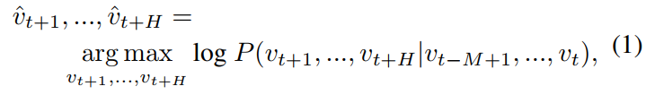
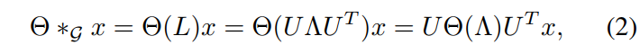
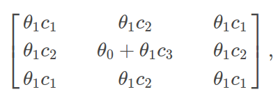
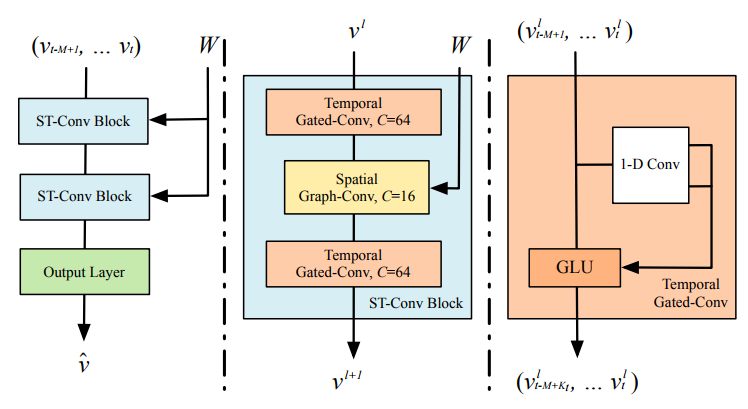
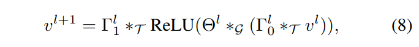
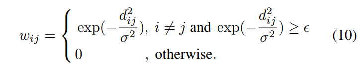

# Spatio-Temporal-Graph-Convolutional-Networks-A-Deep-Learning-Framework-for-Traffic-Forecasting

# reference
- https://www.zhihu.com/question/54504471
- https://en.wikipedia.org/wiki/Laplacian_matrix
- https://tkipf.github.io/graph-convolutional-networks/
- https://www.inference.vc/how-powerful-are-graph-convolutions-review-of-kipf-welling-2016-2/
- http://cs229.stanford.edu/section/cs229-moregaussians.pdf

# abstract
- Spatio-Temporal Graph Convolutional Network
- tackle the time series prediction problem in traffic domain
- complete convolutional structures.

# introduction
- linear regression perform well on short interval forecast instead of long terms
- this is a data-driven and using spotio-temporal information method.
- fully utilize spatio-information instead of treating it as discrete units
- $$\hat v_{t+1},...,\hat v_{t+H}  = argmax log_{10} P(v_{t+1},...,v_{t+H}|v_{t-M},...,v_{t})$$
- 
- where $$v_t \in R^n$$, n is an observation vector of n road segments at time step t

## Convolutions on Graphs

- normalized Laplacian
	- Random walk normalized Laplacian

	- analogy to The Multivariate Gaussian Distribution 

	- Symmetric normalized Laplacian  L:

- first generation of GNC

- second generation of GNC

	- if k == n, receptive field is n hop 
- third generation of GNC

	- where $$c_1$$, $$c_2$$ and $$c_3$$ are fixed
	- The only trainable parameters are $$\theta_0$$ and $$\theta_1$$
	- in the final version the authors even further fix $$\theta_0 = -\theta_1$$

# Network Architecture
- main architecture

- GLU architecture

- main equation

- final equation

# Experiments
- linear interpolation method for missing values
- normalized by standard score method((x-mean)/std)
- adjacency matrix

10,0.5

# result

